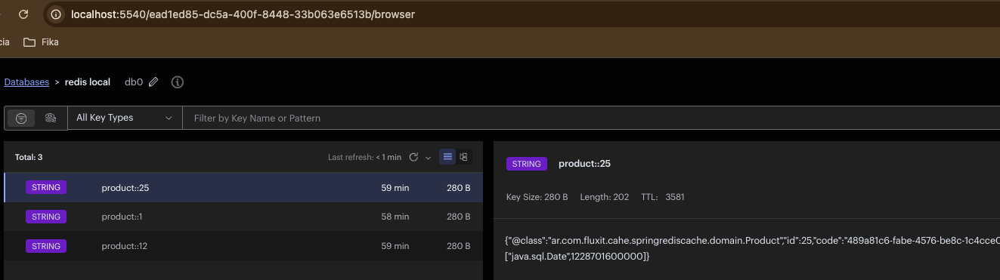

# Spring Boot Caching with Redis
Este repositorio contiene un ejemplo simple de cómo implementar el caché Redis en una aplicación Spring Boot, utilizando todo su potencial para producir importantes ventajas de performance.

Redis es una base de datos NoSQL, por lo que no tiene tablas, filas ni columnas. Además, no permite instrucciones como seleccionar, insertar, actualizar o eliminar. En cambio, Redis utiliza estructuras de datos para almacenar datos. Como resultado, puede ofrecer elementos solicitados con frecuencia con tiempos de respuesta inferiores a un milisegundo y permitir un escalamiento sencillo para cargas de trabajo más grandes sin aumentar el costo de un sistema de back-end.

Redis se puede utilizar de varias maneras, entre ellas com caché:
- **Caché**: muchas aplicaciones tienen dificultades para almacenar y recuperar datos rápidamente, especialmente en sistemas con alta latencia. Debido a su velocidad, Redis es la opción ideal para almacenar en caché llamadas de API, estados de sesión, cálculos complejos y consultas de bases de datos

## ¿Cómo funciona el almacenamiento en caché de Redis?
Redis Cache almacena eficazmente los resultados de las operaciones de recuperación de la base de datos, lo que permite que las solicitudes posteriores recuperen los datos directamente desde la memoria caché. Esto mejora significativamente el rendimiento de la aplicación al reducir las llamadas innecesarias a la base de datos.


# Prerequisitos
Para simular un ambiente productivo nos conectaremos a un base de datos PostgresSQL y utilizaremos un servidor de Redis para caché.
Solo hace falta tener instalado Docker Desktop (el pack docker engine y docker compose). La opción más directa es instalar [DockerEngine](https://docs.docker.com/engine/install/) y elegir la que corresponde a tu sistema operativo.

En el directorio raiz de este proyecto encontraras un archivo llamado **docker-compose.yml** que hace toda la magia. Por un lado levanta un contenedor con el motor **PostgresSQL** y otro contendor con el servidor de **Redis** , y por otro lado, levanta otros dos conenedores de clientes web,  pgAdmin que pueden conectarse al PostgresSQL y redisinsight que puede conectarse a Redis. Solo tenes que correr el siguiente comando:
```
docker compose up
```
### pgAdmin
Para controlar que todo esta OK, voy a acceder al motor PostgresSQL a través del cliente pgAdmin.
Según la configuración que figura dentro del archivo **docker-compose.yml** el contenedor pgAdmin se disponibiliza en el puerto 8090 de la máquina local http://localhost:8090, tenés que ingresar **fluxit@flux.com** como usuario y contraseña **admin** para acceder a este cliente web.

Una vez que ingresás tenés que registrar el server, le podés poner el nombre que quieras, en el Host Name sí hay que utilizar el mismo nombre que define el archivo **docker-compose.yml** como container de Postgres, en este caso esta configurado **postgres_redis_sql**. El puerto es 5432, el username y la contraseña deben ser **fluxdb:fluxdbpwd**

### redisinsight
De igual forma, voy a acceder al servidor Redis a través del cliente redisinsight.
Según la configuración que figura dentro del archivo **docker-compose.yml** el contenedor redisinsight se disponibiliza en el puerto 5540 de la máquina local http://localhost:5540.

Una vez que ingresás tenés que agregar la base de datos Redis, le podés poner el dabaseAlias que quieras, en el Host Name sí hay que utilizar el mismo nombre que define el archivo docker-compose.yml como container, en est caso Redis. El puerto es 6379, el username queda vacio y la contraseña deben ser el valor configurado para ${POSTGRES_PASSWORD}


### Configuración del source
La conexión a la base se configura en el archivo application.properties
```
spring:
  .......
  datasource:
    driver-class-name: org.postgresql.Driver
    url: jdbc:postgresql://0.0.0.0:5432/cacheablestore
    username: fluxdb
    password: fluxdbpwd
```

- 0.0.0.0 apunta a nuestro contenedor de Docker y 5432 es el puerto que expone el contenedor para conectarnos a PostgresSQL
- **cacheablestore**  es el nombre de base de datos creada en el script de creación de base de datos
- el usuario y contraseña son los definidos en el mismo script de creación de base de datos

### Configuracion de Redis

```
spring:
  .......
  cache:
    type: redis
  data:
    redis:
      host: localhost
      port: 6379
      password: 1qaz!QAZ
```

- Se indica que la cache será del tipo Redis
- host: es la ubicación donde se encuentra el servidor de redis para cache
- port: es el puerto expuesto del contenedor del servidor de redis
- password es la  definida en la creación de contenedor del servidor de redis

## Set de Datos
Utilizaremos una clase de boostraping para generar un set de datos.

la clase  **ProductBootstrap** generará el siguiente set de datos.
- Generá 100 productos con datos aleatorios

```
@Service
public class ProductBootstrap implements InitializingBean {
.........
   @Override
    public void afterPropertiesSet() throws Exception {
        IntStream.range(0,BATCH_SIZE).forEach(i->
            with( new Product(), p-> {
                p.setName(String.format("Product->%d", i));
                p.setCode(UUID.randomUUID());
                p.setAviailable(true);
                p.setReleaseDate(randomDate());
                prodcuts.add(p);
            })
        );
        productService.saveAll(prodcuts);
    }
}
```

## Endpoints
Los endpoint que publica el web server son:

| Método |Endpoint| comentarios                                                  | 
|--------|--------|--------------------------------------------------------------|
| Get    |/product/{id}| Recuera el producto por el id y genera los datos en la caché |
| Delete |/product/{id}| Borrar la caché y borra el producto de la base de datos      |                

## Time To Live de la Cache
Una buena práctica para el almacenamiento en caché es asegurarse de que los datos redundantes y en exceso no se acumulen indefinidamente, ya que esto puede dar como resultado que se entreguen a los usuarios datos obsoletos o desactualizados. Para lograr esto, podemos aprovechar la propiedad de tiempo de vida, que es una configuración opcional que nos permite establecer el tiempo de vencimiento de los datos almacenados en caché. Una vez transcurrido el tiempo especificado, la entrada almacenada en caché se elimina automáticamente de la memoria caché. Esto crea espacio para que se obtengan y almacenen nuevos datos en la memoria caché la próxima vez que se soliciten. Si no se asigna ningún valor a la propiedad, se convierte en -1 de forma predeterminada, lo que significa que los datos permanecerán en la memoria caché indefinidamente
Para seterar un ttl especifico de la cache de debe generar en un configuracion a través del caché manager de la sigiente manera:
```
@Configuration
@EnableCaching
public class RedisCacheConfig {

    @Bean
    public CacheManager cacheManager(RedisConnectionFactory redisConnectionFactory) {

        RedisCacheConfiguration productCacheConfig = RedisCacheConfiguration.defaultCacheConfig()
                .entryTtl(Duration.ofSeconds(3600))
                .serializeValuesWith(RedisSerializationContext.SerializationPair.fromSerializer(new GenericJackson2JsonRedisSerializer()));

        Map<String, RedisCacheConfiguration> cacheConfigurations = new HashMap<>();
        cacheConfigurations.put("product", productCacheConfig);

        return RedisCacheManager.builder(redisConnectionFactory)
                .withInitialCacheConfigurations(cacheConfigurations)
                .build();
    }
}
```

## Servicios Cacheables
Almacenamiento en caché basado en anotaciones en la capa de servicios

Utilice anotaciones de almacenamiento en caché en la capa de los servicios para habilitar el almacenamiento en caché para métodos específicos:

- @Cacheable Se utiliza para recuperar datos de la base de datos y almacenarlos en la memoria caché. En futuras invocaciones, el método recupera el valor almacenado en caché directamente, lo que elimina la necesidad de ejecutar el método nuevamente.
```
    @Cacheable(value = "product", key = "#id", unless="#result == null")
    @Transactional(Transactional.TxType.NEVER)
    public CompletableFuture<Product> findById(Long id) {
        return CompletableFuture.supplyAsync(
                () -> productRepository.findById(id).orElseThrow(
                        ()->new NotFoundException("No se encontro el producto con el id: " + id))
        );
    }
```

El  atributo value establece una caché con un nombre específico (igual al nombre definido en el cache manager), mientras que el atributo key permite el uso del lenguaje de expresión Spring para calcular la clave de forma dinámica. En consecuencia, el resultado del método se almacena en la caché "product", donde el "id" respectivo sirve como clave única. Este enfoque optimiza el almacenamiento en caché al asociar cada resultado con una clave distinta. Por ultimo, la registración en la cache se realizará solo si el resultado no es null, es decir si se recupera los datos y el optional es null ese dato no es registrado en la chace.



- @CacheEvict se utiliza para eliminar datos obsoletos o no utilizados de la memoria caché.

```
    @CacheEvict(cacheNames = "product", key = "#product.id", beforeInvocation = true)
    @Transactional(Transactional.TxType.REQUIRED)
    public CompletableFuture<Void> deleteProduct(Product product) {
        return CompletableFuture.runAsync(() -> productRepository.delete(product));
    }
```
Usamos cacheName y key para eliminar datos específicos de la memoria caché. El beforeInvocation nos permite controlar el proceso de expulsión, lo que nos permite elegir si la expulsión debe ocurrir antes o después de la ejecución del método.

El cacheNamesatributo es un alias de valuey se puede utilizar de manera similar.